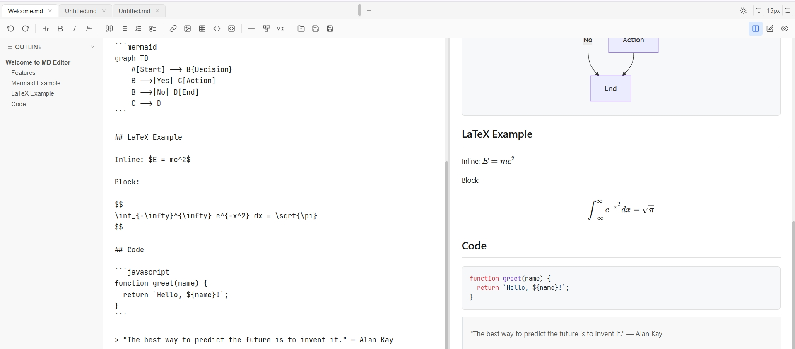

# MD Editor

Markdown Editor for Chrome 

## Loading the extension

1. Open `chrome://extensions`
2. Enable Developer mode
3. "Load unpacked" → select the repo root directory
4. Click the extension icon or use the toolbar button to open the editor

## Architecture

- **`background.js`** — service worker; opens `index.html` in a new tab on action click
- **`index.html`** — single-page app shell; loads all libs via `<script>` tags, then `editor.js`
- **`editor.js`** — entire app logic (~860 lines, IIFE, strict mode). Contains tab management, toolbar actions, markdown rendering, undo/redo, outline, theme toggle, file I/O
- **`styles.css`** — all styles, including light/dark theme via `data-theme` attribute

